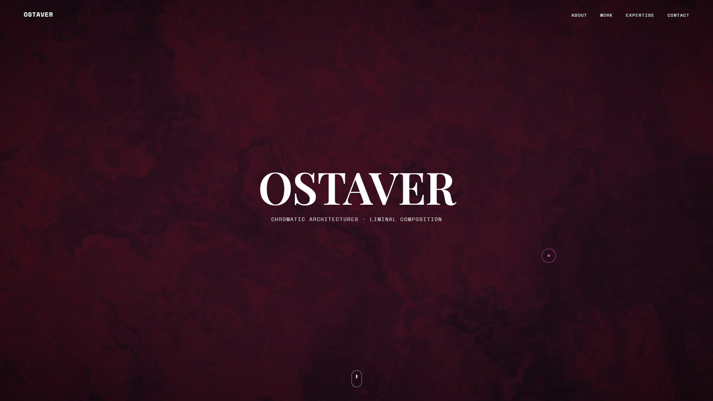
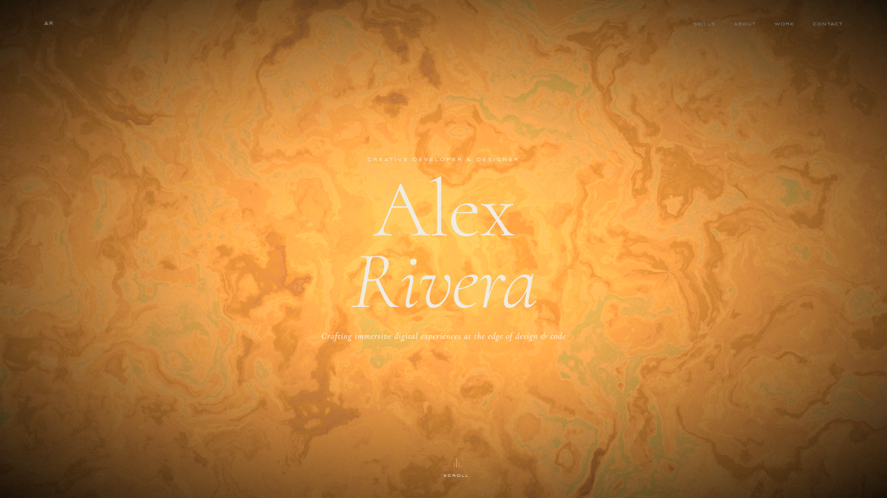
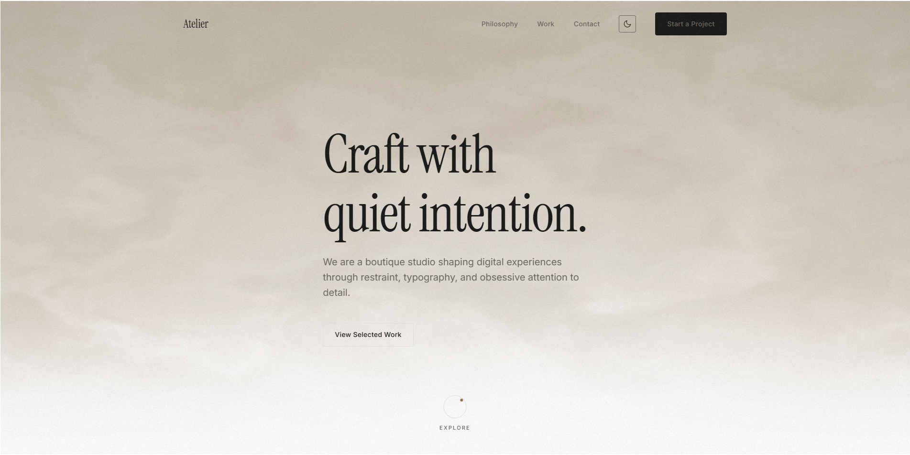
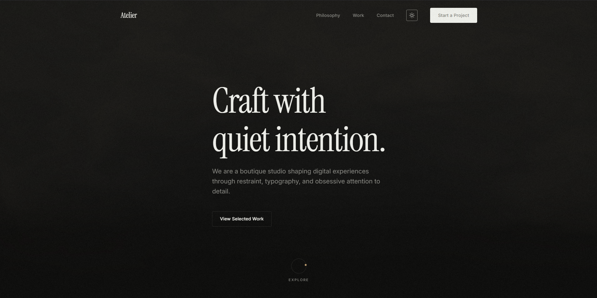

# Sharp Design

Welcome to Sharp Design, a collection of AI agent skills for building professional award-winning websites. Each skill is a self-contained design language — a set of convictions, proportions, and aesthetic rules that an AI agent follows to produce original, high-quality single-page sites. Drop a skill into your agent's context and it builds to spec.

SKILL Template in use - [SKILL Creator](https://github.com/ostaver/Sharp-Design/blob/main/SKILL%20CREATOR.md).

---

## Quick Start

1. **Pick a design language** — start with [Argon](#argon) or [Atelier](#atelier) for a single-file site, or [Binary](#binary) for a multi-file technical reference site.
2. **Copy the skill** — open your chosen language's `SKILL.md` file. Or just drag and drop.
3. **Paste into your AI agent** — drop the full contents into the system prompt or context window of any supported model (Claude Sonnet/Opus, GPT-5, DeepSeek, Qwen, etc.).
4. **Describe your site** — tell the agent what you want: *"Create a portfolio website for a ceramic artist. Use Argon, 6 sections."*
5. **Run and deploy** — the agent will generate all files locally or give you a single `.html` file ready to open or deploy.

**Example prompt for Argon:**
```
Use the Argon skill to build a single-page site for a generative art studio. Include: hero, about, gallery grid, manifest, process, contact. Make it dark and atmospheric.
```

**First try?** Use Atelier — it's the most famous among AI Agents, it's simple and will probably work with most of the models (without the shader).

> **Note:** Skill token costs range from ~4,200 (Atelier) to ~18,600 (Binary). Make sure your model supports a long enough context window. We recommend models with at least 128k tokens of context.

---

## What is a skill?

A skill is a `SKILL.md` file that lives inside a design language folder. It defines everything the agent needs: layout grammar, component vocabulary, CSS design tokens, JavaScript runtime, and content guidelines. The agent writes all output files from scratch — no templates are copied, no binaries are bundled.

Every build should feel like it belongs to the design language but never look like a clone of a previous build. Variation is intentional and built into each skill. 
> *All the skills are reviewed by a senior frontend engineer.*

---

## Design languages

### Argon
> *Dark, technical, gallery-grade.*

Portfolio-first design language for artists, studios, and creative technologists. Lives at the intersection of a gallery opening and a terminal window. Serif voice, monospace structure, WebGL atmosphere, custom cursor.

- **Style:** Dark, editorial, precision-obsessed
- **Stack:** HTML · CSS · JavaScript · WebGL
- **Tokens:** ~5,000 context tokens
- **Score:** 8.7 / 10
- **Best for:** Artist portfolios, digital studios, creative technologists
- **Result File Type:** .html 

| OSTAVER Prompt | Alex Prompt |
|---|---|
|  |  |

---

### Atelier
> *Minimalist, typographic, craft-obsessed.*

Boutique design language for studio portfolios and landing pages. Warm restraint, serif headlines, ambient motion. Every element earns its place. "We don't decorate; we clarify."

- **Style:** Editorial, elegant, enterprise-ready
- **Stack:** HTML · CSS · JavaScript · WebGL
- **Tokens:** ~4,200 context tokens
- **Score:** 9 / 10
- **Best for:** Studios, agencies, independent makers, craft-driven brands
- **Result File Type:** .html

| White Theme | Dark Theme |
|---|---|
|  |  |

---

### Binary
> *Dark, monochrome, pixel-perfect. Resource-Heavy*

Fixed-frame technical reference site. Monospace throughout, live WebGL fragment shader hero, percentage loader, CSS glitch image effects, giant footer wordmark, custom cursor, scroll-reveal motion. Everything is fetched from CDNs or written inline — four plain text files, nothing else.

- **Style:** Instrument panel, dark, programmer-grade
- **Stack:** HTML · CSS · JavaScript · WebGL · Node.js
- **External:** Google Fonts · Lucide Icons · Unsplash
- **Tokens:** ~18,600 context tokens
- **Score:** 9.6 / 10
- **Best for:** Technical products, developer tools, SaaS, reference sites
- **Result File Type:** Repository/Folder 

| Filip Prompt | Jason Prompt |
|---|---|
|  |  |

---

### Comfort
> *Smooth, minimalistic, buttery.*

An Astro-native design language for studios, product teams, and culture-forward brands. Builds a complete component-based Astro repository with TypeScript, CSS Modules, and Vite. Material voice: adobe, concrete, kiln. "Honest materials, honest code."

- **Style:** Smooth, Zen, component-first
- **Stack:** Astro.js · JavaScript · CSS Modules · Vite 
- **External:** Google Fonts (`Playfair Display`, `Inter`, `JetBrains Mono`) · Unsplash
- **Tokens:** ~11,000 context tokens
- **Score:** 9.2 / 10
- **Best for:** Studios, product teams, culture brands, editorial platforms
- **Result File Type:** Repository/Folder

| Dark Theme | Light Theme |
|---|---|
|  |  |

---

## Comparison

| | Argon | Atelier | Binary | Comfort |
|---|---|---|---|---|
| Aesthetic | Gallery / terminal | Editorial / warm | Instrument / cold | Raw / architectural |
| Type voice | Serif + mono | Serif + sans | Mono only | Display + sans + mono |
| Hero | WebGL backdrop | Ambient motion | WebGL GLSL shader | Textured gradient / SVG noise |
| Cursor | Custom | Custom | Custom | None |
| Complexity | Medium | Low–Medium | High | Medium–High |
| Token cost | ~5k | ~4.2k | ~18.6k | ~11k |
| Result | .html | .html | Folder/Repository | Folder/Repository |

---

## Using a skill

1. Two options: Either an Agent or a direct LLM (Claude, GPT-5, DeepSeek, Qwen, etc.)
2. Paste the contents of the `SKILL.md` file into the system prompt or as a context file
3. Tell the agent what you want to build — brand, copy, section ideas
4. The agent produces all output files; you run them locally or deploy as-is

> **Tip:** Some skins output folder structures, it is advised to use an AI Agent for that purpose, integrated into the local system.
> **Example prompt for a skill:** Create a website about AI and machine learning. Use the skill "Argon", 6 sections. Unique and creative website.


### Recommended models

Most skills work well with:
- Claude (Sonnet / Opus)
- DeepSeek
- GPT /Codex (superior tiers)
- Qwen (superior tiers)
- Kimi K2
- GLM / Z.ai
- Grok

Avoid for all skills: Mistral, Meta/Llama, and other smaller open-weight models.

---

## Repo structure
```
Sharp-design/
├── Argon/
│   ├── About.md                        ← human-readable skill notes
│   ├── argon-developer-skill/
│   │   └── SKILL.md                    ← agent skill file
│   └── *.png                           ← preview images
├── Atelier/
│   ├── About.md
│   ├── atelier-minimalist-skill/
│   │   └── SKILL.md
│   └── *.png
├── ...
└── README.md
```

Each design language lives in its own folder. `About.md` is for humans — model compatibility, token cost, score, notes. `SKILL.md` is for the agent.

---

## Contributing

Contributions are welcome — new design languages, improvements to existing skills, fixes, and documentation.

### Adding a new design language

1. **Fork** the repository and create a branch: `git checkout -b language/your-language-name`
2. Create a folder: `YourLanguage/your-language-skill/SKILL.md`
3. Add an `About.md` in the top-level language folder following the existing format (model compatibility, token count, word count, character count, score, description)
4. Include at least one preview image in the language folder if possible
5. Open a pull request with a short description of the aesthetic and what makes it distinct from existing styles/skills

**A new language must:**
- Have a clear, named aesthetic conviction (not just "a clean site")
- Produce original output on every run — not a fixed template
- Be fully standalone (no local binaries, no private CDNs)
- Include a complete `SKILL.md` with layout grammar, component spec, and a runtime implementation

### Improving an existing skill

- **Bug fixes** (broken CSS, JS errors, incorrect CDN URLs) — open a PR directly with a clear description
- **Improvements** (better compression, new variation presets, additional section types) — open an issue first to discuss, then PR
- **Model compatibility updates** — if you find a model produces notably good or bad results with a skill, update the `About.md` and note it in the PR

### Style guidelines

- Keep `SKILL.md` files self-contained — an agent should be able to build a complete site from the file alone, with no outside context
- Prefer compression over verbosity: fewer tokens, clearer instructions
- Do not introduce external API dependencies, authentication, or server-side logic into a skill
- All CDN resources must be from well-known, public hosts (`fonts.googleapis.com`, `unpkg.com`, `images.unsplash.com`, etc.)

### Pull request checklist

- [ ] `SKILL.md` produces a working site when given to a recommended model
- [ ] `About.md` is filled in (token count, word count, character count, model compatibility, score)
- [ ] No binary assets committed (`.woff2`, `.png` previews are the only exception)
- [ ] CDN URLs in examples have been verified as live
- [ ] Branch name follows `language/name` or `fix/description` or `improve/language-name`

### Opening issues

Use issues for:
- Reporting a broken skill (model, prompt used, and observed output help a lot)
- Proposing a new design language concept
- Discussing significant changes to an existing language's grammar

---

## License

See [LICENSE](./LICENSE).
