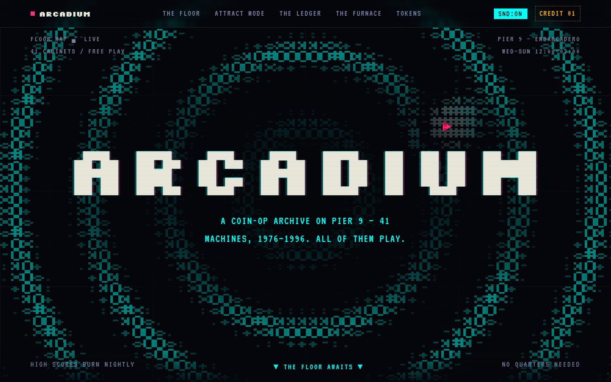
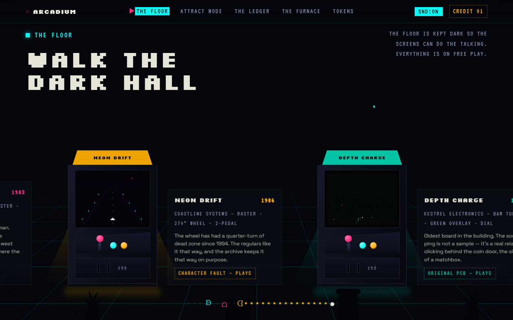
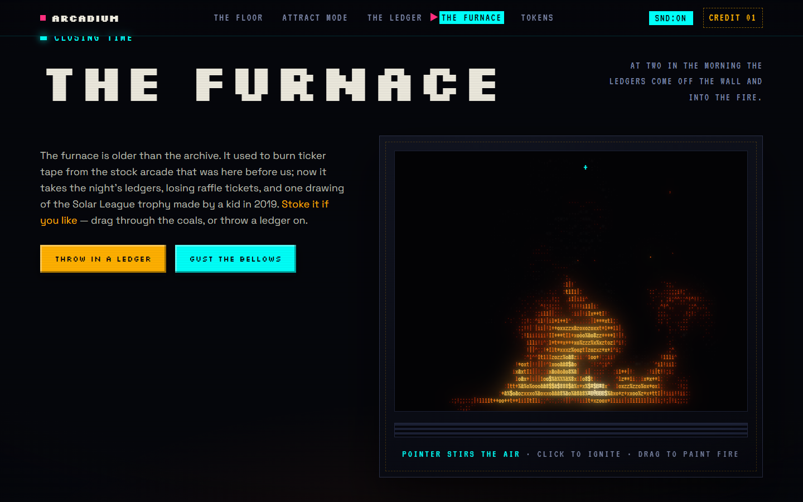
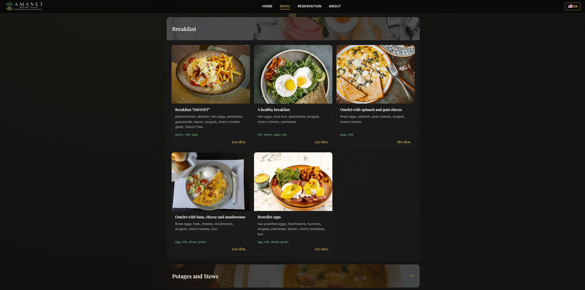
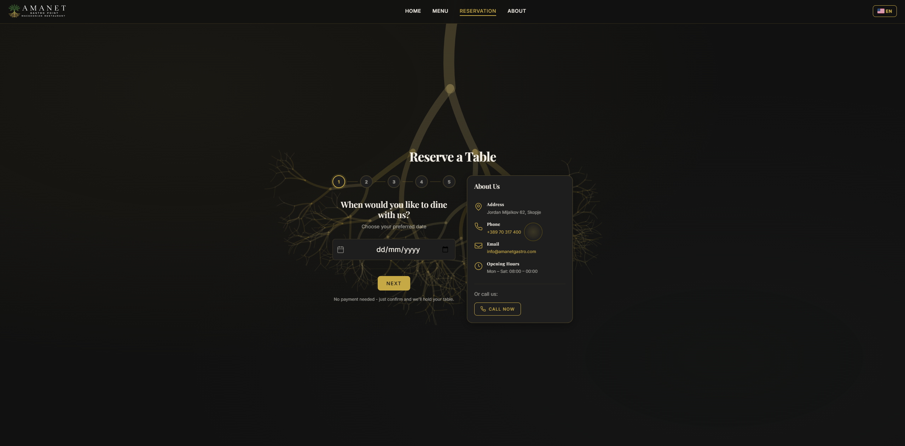
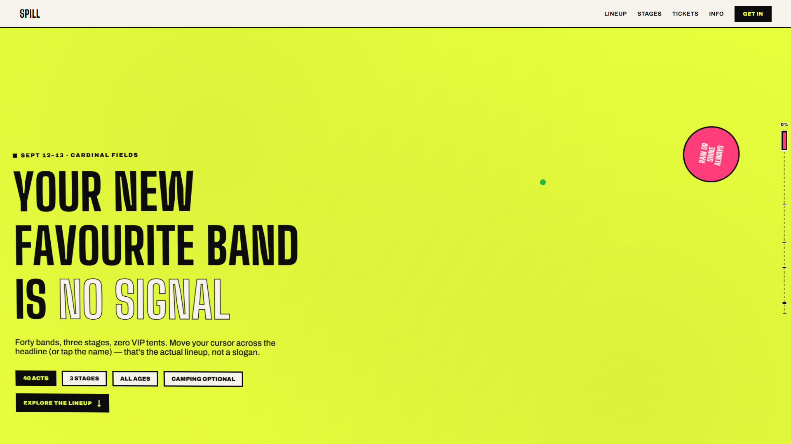

<p align="center">
  
</p>

<h1 align="center">Sharp Design v1.0.0</h1>

<p align="center">
  <strong>A frontend skill library for AI agents.</strong><br>
  Drop in a design language, describe your site, get original, production-grade output.
</p>

<p align="center">
  
  
  <a href="./LICENSE"></a>
</p>

---

## What is Sharp Design?

Sharp Design is a collection of **agent skills for building professional, award-level websites**. Each skill is a self-contained *design language*: a set of convictions, proportions, component rules and a runtime that an AI agent follows to produce an original site.

- **Not templates.** The agent writes every file from scratch. Nothing is copied, no binaries are bundled.
- **Never clones.** Each skill builds variation in, so two builds feel related but are never identical.
- **Model-agnostic.** A skill is a plain Markdown file. It works with any capable LLM or coding agent.

---

## Skills at a glance

| Skill | Aesthetic | Stack | Output | Tokens | Score |
| --- | --- | --- | --- | --- | --- |
| [**Arcadium**](#arcadium) | Dark coin-op arcade, playable | React · GSAP · Three.js · Vite | Repo/folder | ~12k | 9.1 |
| [**Argon**](#argon) | Dark, technical, gallery-grade | HTML · CSS · JS · WebGL | Single `.html` | ~5k | 8.7 |
| [**Atelier**](#atelier) | Minimalist, typographic, craft | HTML · CSS · JS · WebGL | Single `.html` | ~4.2k | 9.0 |
| [**Belfort**](#belfort) | Dark, elegant, bilingual, CMS-backed | HTML · CSS · JS · Firebase | Multi-page repo | ~9k | 7.6 |
| [**Binary**](#binary) | Dark, monochrome instrument panel | HTML · CSS · JS · WebGL · Node | Repo/folder | ~18.6k | 9.6 |
| [**Comfort**](#comfort) | Warm, smooth, editorial | Astro · CSS Modules · Vite | Repo/folder | ~13k | 9.2 |
| [**Mirage**](#mirage) | Achromatic op-art, kinetic type | HTML · CSS · Canvas · anime.js | Single `.html` | ~7.5k | 9.4 |
| [**Stackable**](#stackable) | Loud, colorful, poster-style events | HTML · CSS · GSAP | Single `.html` | ~10k | n/a |

> **Not sure where to start?** Use **Atelier** for a quick single-file site, **Binary** or **Comfort** for a full repository, and **Belfort** when you need a backend.

---

## Quick start

1. **Pick a skill** from the table above.
2. **Open its `SKILL.md`** (for example [`Atelier/atelier-skill/SKILL.md`](Atelier/atelier-skill/SKILL.md)).
3. **Give it to your agent.** Attach the file, paste it into the context window, or drop it in as a project skill.
4. **Describe your site.** Say which skill to use, what the site is for, and which sections you want.
5. **Run and deploy.** You get a single `.html` file or a project folder, ready to open or host.

**Example prompt**

```md
Use the Atelier skill to build a single-page site for a generative art studio.
Include: hero, about, gallery grid, manifest, process, contact. Be unique and original.
```

> **Context budget:** skills cost roughly 4k to 18k tokens. Use a model with at least a 128k context window.

### Using with Claude Code

Copy a skill folder into your project or user skills directory, and Claude Code will pick it up by name:

```bash
mkdir -p ~/.claude/skills/atelier
cp Atelier/atelier-skill/SKILL.md ~/.claude/skills/atelier/SKILL.md
```

Then ask: *"Use the atelier skill to build a landing page for a ceramics studio."*

---

## How a skill works

A skill is a `SKILL.md` file inside a design-language folder. It defines everything an agent needs:

- **Conviction:** the named aesthetic and the rules it never breaks.
- **Layout grammar:** proportions, section types and composition rules.
- **Component vocabulary:** how nav, hero, cards, forms and footers look and behave.
- **Design tokens:** colors, type, spacing and motion as CSS custom properties.
- **Runtime:** the JavaScript for motion, canvas/WebGL, cursor and interaction.
- **Content guidance:** the voice, and a ban on reusing reference copy.

Each language folder also has an `About.md`. It is written for humans and covers what the skill produces, its requirements, model compatibility and score.

Want to write your own? Start from the [SKILL Creator](SKILL%20CREATOR.md) template.

---

## The skills

### Arcadium

> *Dark coin-op arcade. The site is dead until you insert a coin.*

A playable arcade for game studios, arcades and retro events. A coin door boots the page, a WebGL ASCII ring wave fills the hero, a scroll-pinned hall of cabinets runs text-mode attract loops, one real ASCII game files your initials onto a printed high-score ledger, and a fluid-simulated ASCII furnace burns the sheet at closing. Every sound is a WebAudio blip.

- **Style:** Arcade floor at 1 a.m., phosphor on black, stepped hardware motion
- **Stack:** React 19 · TypeScript · Vite · GSAP / ScrollTrigger · Lenis · Three.js
- **External:** Google Fonts (pixel, terminal and grotesk faces)
- **Best for:** Arcades, game studios, retro events, esports bars, play-driven brands
- **Output:** Repository/folder (give the agent the whole `arcadium-skill/` folder, since it bundles the effect files)

| Hero                                     | The floor                                  | The furnace                                    |
| ---                                      | ---                                        | ---                                            |
|  |  |  |

[SKILL.md](Arcadium/arcadium-skill/SKILL.md) · [About](Arcadium/About.md)

---

### Argon

> *Dark, technical, gallery-grade.*

Portfolio-first language for artists, studios and creative technologists. It sits between a gallery opening and a terminal window: serif voice, monospace structure, WebGL atmosphere, custom cursor.

- **Style:** Dark, editorial, precision-obsessed
- **Stack:** HTML · CSS · JavaScript · WebGL
- **Best for:** Artist portfolios, digital studios, creative technologists
- **Output:** `.html`

| OSTAVER prompt                     | Alex prompt                  |
| ---                                | ---                          |
|  |  |

[SKILL.md](Argon/argon-skill/SKILL.md) · [About](Argon/About.md)

---

### Atelier

> *Minimalist, typographic, craft-obsessed.*

Boutique language for studio portfolios and landing pages. Warm restraint, serif headlines, ambient motion. Every element earns its place.

- **Style:** Editorial, elegant, enterprise-ready
- **Stack:** HTML · CSS · JavaScript · WebGL
- **Best for:** Studios, agencies, boutiques, craft-driven brands
- **Output:** `.html`

| White theme                                       | Dark theme                                      |
| ---                                               | ---                                             |
|  |  |

[SKILL.md](Atelier/atelier-skill/SKILL.md) · [About](Atelier/About.md)

---

### Belfort

> *Dark, elegant, and ready to run a business.*

A multi-page marketing site with a generative canvas background themed to the brand, optional bilingual support, a Firebase backend (Firestore and Auth), an admin CMS panel and an EmailJS contact/reservation form. It is vanilla HTML/CSS/JS with no build step, and it ships with a detailed client README.

- **Style:** Dark, elegant, token-driven
- **Stack:** HTML · CSS · JavaScript · Firebase · EmailJS
- **Requires:** A Firebase project (free Spark plan is enough) and, optionally, an EmailJS account
- **Best for:** Restaurants, services, small businesses, anything that needs editable content
- **Output:** Repository/folder

| Landing                                 | Menu                        | Reservation                          |
| ---                                     | ---                         | ---                                  |
|   |    |  |

[SKILL.md](Belfort/belfort-skill/SKILL.md) · [About](Belfort/About.md)

---

### Binary

> *Dark, monochrome, pixel-perfect. Resource-heavy.*

A fixed-frame technical reference site. Monospace throughout, a live WebGL fragment-shader hero, a percentage loader, CSS glitch imagery, a giant footer wordmark, custom cursor and scroll-reveal motion. The whole build is four plain text files.

- **Style:** Instrument panel, dark, programmer-grade
- **Stack:** HTML · CSS · JavaScript · WebGL · Node.js
- **External:** Google Fonts · Lucide Icons · Unsplash
- **Best for:** Technical products, developer tools, SaaS, reference sites
- **Output:** Repository/folder

| Filip prompt                                       | Jason prompt                               |
| ---                                                | ---                                        |
|  |  |

[SKILL.md](Binary/binary-skill/SKILL.md) · [About](Binary/About.md)

---

### Comfort

> *Smooth, minimalistic, buttery.*

An Astro-native language for studios, product teams and culture-forward brands. It builds a component-based Astro repository with TypeScript, CSS Modules and Vite. The material voice is adobe, concrete, kiln: honest materials, honest code.

- **Style:** Smooth, Zen, component-first
- **Stack:** Astro · JavaScript · CSS Modules · Vite
- **External:** Google Fonts (Playfair Display, Inter, JetBrains Mono)
- **Best for:** Studios, product teams, culture brands, editorial platforms
- **Output:** Repository/folder

| Dark theme                        | Light theme                         |
| ---                               | ---                                 |
|  |  |

[SKILL.md](Comfort/comfort-skill/SKILL.md) · [About](Comfort/About.md)

---

### Mirage

> *Achromatic op-art. The content itself is the illusion.*

Strictly black and white, for perception studios and exhibition sites: kinetic variable-width typography, a cursor-reactive moiré hero, and live optical illusions on canvas, each with a press-and-hold "reveal the trick" interaction. One variable font, no accent color, no dark mode. Animated with anime.js v4.

- **Style:** Op-art, achromatic, kinetic type
- **Stack:** HTML · CSS · JavaScript · Canvas 2D · anime.js v4 (CDN)
- **External:** Google Fonts (variable `wdth` family, e.g. Archivo)
- **Best for:** Studios, exhibitions, experimental portfolios
- **Output:** `.html`

| Hero                                    | Works                                     |
| ---                                     | ---                                       |
|  |  |

[SKILL.md](Mirage/mirage-skill/SKILL.md) · [About](Mirage/About.md)

---

### Stackable

> *Loud, colorful, poster-like.*

A high-contrast editorial language for independent festivals, live events and music-led campaigns. It turns dense event information into a tactile poster: compressed display type, flat saturated color fields, hard rules and kinetic programme cues. It includes GSAP/ScrollTrigger choreography and a desktop scroll sidebar, with fallbacks for no-JS and reduced motion.

- **Style:** Print-poster color blocking, condensed type
- **Stack:** HTML · CSS · JavaScript · GSAP / ScrollTrigger
- **Best for:** Festivals, live events, cultural programmes, campaigns
- **Output:** `.html`

| Hero                     | Middle section                       |
| ---                      | ---                                  |
|  |  |

[SKILL.md](Stackable/stackable-skill/SKILL.md) · [About](Stackable/About.md)

---

## Comparison

| | Arcadium | Argon | Atelier | Belfort | Binary | Comfort | Mirage | Stackable |
| --- | --- | --- | --- | --- | --- | --- | --- | --- |
| **Mood** | Arcade / nocturnal | Gallery / terminal | Editorial / warm | Dark / elegant | Instrument / cold | Warm / soft | Op-art / clinical | Loud / poster |
| **Theme** | Dark | Dark | Light + dark | Dark | Dark | Light + dark | Light only | Colorful |
| **Type voice** | Pixel + terminal + sans | Serif + mono | Serif + sans | Serif + sans | Sans + mono | Serif + sans | Variable width sans | Condensed display |
| **Hero** | WebGL ASCII wave | WebGL backdrop | Ambient motion | Generative canvas | GLSL shader | Textured gradient | Moiré canvas | Full-impact type |
| **Backend** | None | None | None | Firebase | Node server | None | None | None |
| **Complexity** | High | Medium | Low–Medium | High | High | High | Medium | Medium–High |
| **Output** | Repo | `.html` | `.html` | Repo | Repo | Repo | `.html` | `.html` |

---

## Models

Skills are tested most on the models below. Prefer models with **200B+ parameters** (30B+ at an absolute minimum).

| Works well | Not recommended |
| --- | --- |
| Claude, GPT / Codex, DeepSeek, Qwen, Kimi K, GLM / Z.ai, Grok | Small models (under ~30B), Mistral, Llama |

Some skills output a folder structure. For those, use an agent with local file access (Claude Code, Codex, Cursor and similar) rather than a plain chat window.

Per-skill compatibility notes live in each `About.md`.

---

## Repo structure

```text
Sharp-Design/
├── <Skill>/
│   ├── About.md               human-readable notes: output, requirements, models, score
│   ├── <skill>-skill/
│   │   └── SKILL.md           the agent instructions
│   └── *.png                  preview images
├── SKILL CREATOR.md           template for writing a new skill
├── Banner.png
├── LICENSE
└── README.md
```

`About.md` is for humans. `SKILL.md` is for the agent.

---

## Contributing

Contributions are welcome: new design languages, improvements to existing skills, fixes and docs.

### Add a new design language

1. **Fork** the repo and create a branch: `git checkout -b style/your-style`
2. Create `YourStyle/your-style-skill/SKILL.md`, starting from the [SKILL Creator](SKILL%20CREATOR.md) template.
3. Add an `About.md` beside it, following an existing one.
4. Add at least one preview image.
5. Open a pull request describing the aesthetic and what makes it distinct from existing skills.

**A new style must:**

- Have a clear, named aesthetic conviction (not just "a clean site").
- Produce original output on every run, not a fixed template.
- Be fully standalone, with no bundled external images.
- Include layout grammar, component style and a runtime implementation.
- Follow the style guidelines below.

### Improve an existing skill

- **Bug fixes** (broken CSS, JS errors, dead CDN URLs): open a PR directly.
- **Improvements** (new variation presets, extra section types, better compression): open an issue first, then a PR.
- **Model compatibility:** if a model does notably well or badly with a skill, update its `About.md` and mention it in the PR.

### Style guidelines

- Keep each `SKILL.md` self-contained. An agent should be able to build a complete site from that file alone.
- Prefer compression over verbosity: fewer tokens, clearer instructions.
- No external APIs, authentication or server-side logic, unless the skill's purpose requires it (as with Belfort). Say so clearly in that skill's `About.md`.
- Load CDN resources only from well-known public hosts (`fonts.googleapis.com`, `unpkg.com`, `cdn.jsdelivr.net`, `cdnjs.cloudflare.com`, `images.unsplash.com`).

### Pull request checklist

- [ ] `SKILL.md` produces a working site when given to a recommended model
- [ ] `About.md` is filled in (output, requirements, token count, model compatibility, score)
- [ ] No binary assets committed apart from `.png` previews and `.woff2` fonts
- [ ] CDN URLs in examples are verified live
- [ ] Branch name follows `style/name`, `fix/description` or `improve/style-name`

### Issues

Use issues to report a broken skill (include the model, prompt and observed output), propose a new design language, or discuss changes to an existing language's grammar.

---

## Changelog

### 1.0.0
- First stable release with seven skills: Argon, Atelier, Belfort, Binary, Comfort, Mirage and Stackable.
- README rewritten with a skills overview, install steps for Claude Code and a full comparison table.

### 0.94
- Pre-release version with five skills.

---

## License

Released under the [MIT License](./LICENSE).
